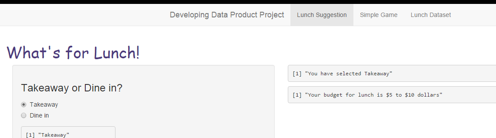
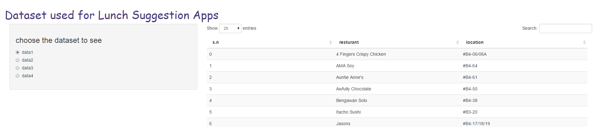

## About the Apps

- There are a total of 2 apps and 1 dataset tab 
- The first app is about suggesting a lunch place for user based on their 2 selections. 
- The second app is about the game "rock, sisscors, paper" to play with the computer. 
- The last tab is to let user select the option on viewing the 4 datasets used for the lunch app.
  - All the 2 apps uses random number generation and ifelse logic in R.

A Screenshot of how the app look like.

 

--- .class #id 

## Lunch App
- This app based on the 2 selection:
  - radio button : take away / dine in (2 options).
  - dropdown on budget selection : $5 to $10 / More than $10 (2 options).
  - Hence, a total of 4 permutations which will direct it to 4 lunch datasets.
      
- The lunch suggestion will be random number generation between 0 to 14.

```r
floor(runif(1,0,15))       
```

```
## [1] 11
```

- With the random number generated, it will row selection from the dataset, serial number. 

```r
  final_lunch2=reactive({if(final_xy1()=="d11"){data11[data11$s.n==z1(),2:3]
  }else if (final_xy1()=="d12"){data12[data12$s.n==z1(),2:3]
  }else if (final_xy1()=="d21"){data21[data21$s.n==z1(),2:3]
  }else {data22[data22$s.n==z1(),2:3]}})    
```

--- .class #id 

## Rock, Paper, Sisscors App

- This App is a simple game play with user entering his/her name. 
  - Then user select rock, paper or sisscor and submit his/her choice to play with the computer.
  - The Main panel will show user and computer choice in the game and the final outcome. 

- The computer choice will be based on random number generation from 0 to 2.

```r
  floor(runif(1,0,3))  
```

```
## [1] 2
```

- The computer choice will be based on random number generation from 0 to 2.

```r
  y_src=reactive({ifelse(final_y()=="rock","images/rock.png",
  ifelse(final_y()=="paper","images/paper.png","images/scissors.png"))})  
```

--- .class #id 

## Thrid Tab on Lunch Dataset

- This tab allow user to see all the 4 dataset on the first app on lunch suggestion.
  - user can choose from the radio button to see each of the lunch datatset.

- Overall the project can be improved by better arranging the 4 datasets to suit the 4 user selection.
 - i.e: the first dataset only include resturant that is really between take-away and $5 to $10 dollar.
- This can also be further modify to suit each location or country to help user on lunch suggestion.

 

